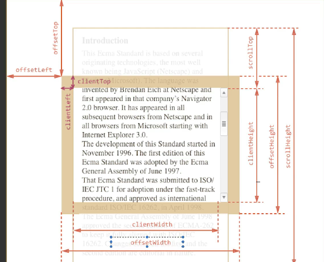

# JS-and-React
## JS в работе
### Параметры окна и документа

Благодаря свойству `scrollTop`, например, можно создать полосу прогресса - сколько контента пользователь уже пролистал/прочитал.

Определение координат элемента по отношению к левому верхнему углу:
`getBoundingClientRect()`

Предыдущие способы забирают реальные свойства элементов со страницы, не из CSS стилей. Можно получить `computed` стили со страницы, которые нельзя менять, только прочитать:
```
const style = window.getComputedStyle(elem); // получаем элемент типа CSSStyleDeclaration
```

Добавить блокировку внешнего контента при открытом модальном окне можно следующим образом:
```
document.body.style.overflow = "hidden";
```

Закрытие модального окна по нажатию на внешнюю область можно сделать так:
```
modalWindow.addEventListener("click", (event) => {
        if (event.target === modalWindow) {
            modalWindow.classList.remove('show');
            modalWindow.classList.add('hide');
            document.body.style.overflow = "visible";
        }
    });
```

Отлавливать события нажатия кнопок:
```
this.document.addEventListener('keydown', (e) => {
        if (e.code === "Escape") {
            closeModal();
        }
    });
```

Узнать event код - https://www.toptal.com/developers/keycode.

Вызов модалки через некоторое время:
```
const modalTimerId = setTimeout(openModal, 1000 * 10); // 10 секунд
```

Вызов модалки (и выполнения любого слушателя) только один раз:
```
function showModalByScroll() {
        // выполнение едйствия
        window.removeEventListener('scroll', showModalByScroll); // удаление слушателя
    }
```

### MutationObserver, ResizeObserver и contenteditable

Слушатели изменений внутри элемента. `MutationObserver` предоставляет возможность получать уведомления об изменении определённых DOM-элементов.

`contenteditable` - универсальный атрибут разрешает редактирование содержимого элемента прямо в браузере.

Все свойства в MutationObserver, за которыми можно следить: https://developer.mozilla.org/ru/docs/Web/API/MutationObserver#mutationobserverinit

Добавление обзервера, например, на box:
```
let boxObserver = new MutationObserver(mutationRecords => {
    console.log(mutationRecords); 
});

boxObserver.observe(box, {
    childList: true // выбираем, за какими конкретно изменениями хотим следить
});

observer.disconnect(); // когда обзервер больше не нужен
```

Изменения записываются в объект типа MutationRecord - https://developer.mozilla.org/en-US/docs/Web/API/MutationRecord

> Отслеживания является **асинхронной** операцией, которая может выполниться чуть позже или раньше, в зависимости от условий. Поэтому и получаем массив изменений.

Примеры обзерверов:
1. PerformanceObserver
2. ResizeObserver - второй по полезности. Отслеживает изменение размеров элементов. Примеры использования - https://www.youtube.com/watch?v=M2c37drnnOA
3. IntersectionObserver

### Функции-конструкторы
Создание множества похожих, однотипных объектов, таких как пользователи, элементы меню и так далее, можно сделать при помощи функции-конструктора и оператора "new".

Функции-конструкторы технически являются обычными функциями. Но есть два соглашения:
1. Имя функции-конструктора должно начинаться с большой буквы.
2. Функция-конструктор должна выполняться только с помощью оператора "new".
```
function User(name) {
  this.name = name;
  this.isAdmin = false;
}
```

Когда функция вызывается как new User(...), происходит следующее:
1. Создаётся новый пустой объект, и он присваивается this.
2. Выполняется тело функции. Обычно оно модифицирует this, добавляя туда новые свойства.
3. Возвращается значение this.

Добавить к закрытым классам новые свойства и функции можно так:
```
<Class>.prototype.<function name> = function(name) {
    console.log(`Hello ${name}`)
}
```

### Контекст вызова функции (this)
То, что окружает функцию, и в каких условиях она вызывается.

1. Если вызывать функцию не в strict-режиме ('use strict'), то `this = window`. При strict-режиме = `undefined`.
2. Контекст у методов объекта - сам объект, т.е. `this = object`
3. Контекстом у функции-конструктра и класса является новый экземпляр объекта.
4. **У стрелочной функции нет своего контекста вызова**. Она берет контекст у своего родителя. В обработчике событий при наличии стрелочных функций можно вместо `this` использовать `event.target.<любое изменение>`

Для передача контекста объекта в другую функцию, есть 3 метода:
1. `<function>.call(object, ...arguments в виде строк)` - только устанавливает контекст
2. `<function>.apply(object, ...arguments в виде одного массива)` - аналогично call.
3. `const newFunction = <function>.bind(object); newFunction(...arguments);` - создает новую функцию, связанную с определенным контекстом.

В функции уже можем обращаться к `this`, и оно будет равен `object`, а не window или undefined.

https://tproger.ru/translations/javascript-this-keyword/

### Классы в ES6
"Обертка" функций-конструкторов. 
```
class <Classname> {
    constructor(arguments) { // создание экземпляра класса
        this.arg1 = arg1; // обращаемся к экземпляру нового созданного объекта
    }

    firstMethod() { // не пишем function
        действия метода;
    }
}
```
https://developer.mozilla.org/ru/docs/Web/JavaScript/Reference/Classes

#### ООП в JS
1. Абстракция
> Абстракция - отделение концепции от ее экземпляра. В данном случае концепция - это класс, а экземпляр концепции - экземпляры класса.
2. Наследование
> Наследование - способность объекта/класса базироваться на другом объекте/классе. В JS для этого есть ключевые слова `extends` и `super`.

Чаще всего наследование в JavaScript реализуется с помощью функции `Object.create()`, позволяющий создать новый объект с заданным прототипом. Однако это прототипное наследование - если у объекта-родителя добавится новое свойство, оно появится и у наследника.
3. Полиморфизм
4. Наследование

http://jsraccoon.ru/es6-classes

### Rest-оператор и параметры по умолчанию
Rest-оператор выполняет операции обработно spread-оператору: отдельные элементы объяединяет в один массив. Записывается всегда последним.

Параметры по умолчанию - чтобы параметр имел базовое значение, даже если не будет передан, необходимо значение прописать через равно:
```
function calcOrDouble(number, basis = 2) {
    console.log(number * basis);
}
calcOrDouble(3); // 6
```

